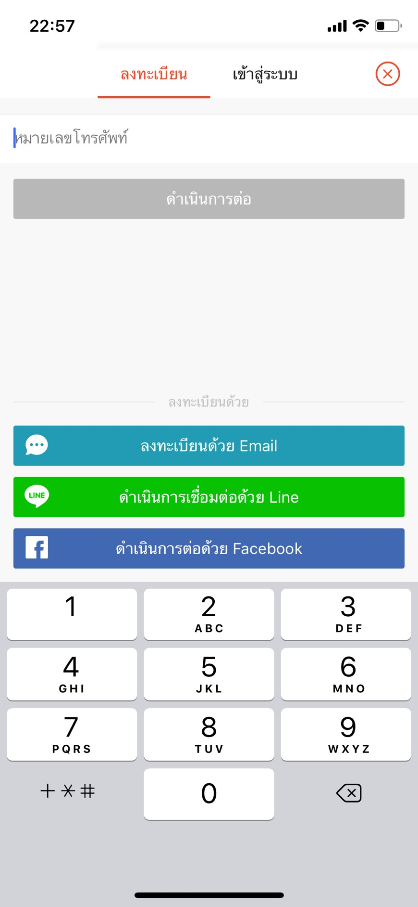

**AUTHENTICATION (การพิสูจน์ตัวตน)**
* การพิสูจน์ตัวตน คือขั้นตอนการยืนยันความถูกต้องของหลักฐาน (Identity) ที่แสดงว่าเป็นบุคคลที่กล่าวอ้างจริง ในทางปฏิบัติจะแบ่งออกเป็น 2 ขั้นตอน คือ 
  - การระบุตัวตน (Identification) คือขั้นตอนที่ผู้ใช้แสดงหลักฐานว่าตนเองคือใครเช่น ชื่อผู้ใช้ (username)
  - การพิสูจน์ตัวตน (Authentication) คือขั้นตอนที่ตรวจสอบหลักฐานเพื่อแสดงว่าเป็นบุคคลที่กล่าวอ้างจริง

**วันนี้เราจะขอยกตัวอย่างการพิสูจน์ตัวตนของแอพพลิเคชั่น Shopee รายละเอียด ดังนี้**

  

* Shopee เป็นตลาดซื้อขายแบบโซเชียลที่มุ่งเน้นการใช้งานผ่านโทรศัพท์มือถืออันดับแรก (Mobile First)
 เพื่อให้ทุกคนสามารถเลือกดูและซื้อขายได้อย่างสะดวก โดยเป็นแพลตฟอร์มที่ออกแบบขึ้นเพื่อชาวเอเชียตะวันออกเฉียงใต้
 ด้วยการผสานคุณลักษณะของตลาดซื้อขายแบบผู้บริโภคสู่ผู้บริโภค (C2C) เข้ากับระบบการชำระเงินและการสนับสนุนด้านโลจิสติกส์
 เพื่อให้การช้อปปิ้งออนไลน์กลายเป็นเรื่องที่สะดวก ปลอดภัย และไร้ความยุ่งยาก
 

  

* โดยหากเราต้องการใช้งานแอพพลิเคชั่น ผู้ใช้ต้องทำการลงทะเบียนเพื่อระบุตัวตน มี 4 ช่องทางดังนี้

  

  * **1.ลงทะเบียนด้วย เบอร์โทรศัพท์** ขั้นตอน คือ
    - 1.1 ระบบจะให้กรอกเบอร์โทรศัพท์ของผู้ใช้งาน
      - หากซ้ำ(เคยลงทะเบียน) -> ระบบจะแจ้งว่า "บัญชีนี้มีอยู่แล้ว ต้องการเข้าสู่ระบบหรือไม่" -> ไปหน้า Login เข้าใช้งานได้ทันที (ไปข้อ 1.3)
      - หากไม่ซ้ำ -> ระบบจะทำการส่งรหัสผ่านชั่วคราว OTP (One Time Password) เป็นข้อความ มาที่เบอร์นั้น เพื่อยืนยันว่าคุณเป็นเจ้าของเบอร์โทรศัพท์นั้นจริง
    - 1.2 ระบบจะให้ผู้ใช้ตั้ง "ชื่อผู้ใช้" และ "รหัสผ่าน" โดยมีข้อแม้ว่า "ชื่อผู้ใช้" ต้องเป็นเอกลักษณ์ห้ามซ้ำกับใคร (unique)
    - 1.3 เข้าสู่ระบบ ด้วย  "ชื่อผู้ใช้" และ "รหัสผ่าน" ที่ตั้งไว้ หรือเราสามารถ เข้าสู่ระบบด้วย SMS -> ระบบจะส่ง OTP Code มาให้กรอกเพื่อเข้าใช้งานได้ทันที
                                              
  * **2.ลงทะเบียนด้วย Email**
    - 2.1 ระบบจะให้กรอก Email ของผู้ใช้งาน
      - หากซ้ำ(เคยลงทะเบียน) -> ระบบจะแจ้งว่า "E-mail ของคุณได้รับการลงทะเบียนแล้ว ต้องการเข้าสู่ระบบหรือไม่" -> ไปหน้า Login เข้าใช้งานได้ทันที
      - หากไม่ซ้ำ -> ระบบจะทำการส่ง LINK ไปยัง E-mail ที่เราสมัคร เพื่อให้เรากดยืนยันต่อไป (ไปข้อ 2.2)
    - 2.2 ระบบจะให้ผู้ใช้ตั้ง "ชื่อผู้ใช้" และ "รหัสผ่าน" โดยมีข้อแม้ว่า "ชื่อผู้ใช้" ต้องเป็นเอกลักษณ์ห้ามซ้ำกับใคร (unique)
    - 2.3 เข้าสู่ระบบ ด้วย  "E-mail" หรือ "ชื่อผู้ใช้" และ "รหัสผ่าน" ที่ตั้งไว้ เพื่อเข้าใช้งาน

  * **3.ลงทะเบียนด้วย Line**
    - 3.1 หากเราเลือกลงทะเบียนผ่าน Line -> แอพพลิเคชั่น Shopee จะทำการติดต่อไปยัง แอพพลิเคชั่น Line ที่ login อยู่ในโทรศัพท์ของผู้ใช้งาน
    - 3.2 Shopee จะขอสิทธิการเข้าถึง "ชื่อ", "รูปโปรไฟล์", "สถานะ" ของ Line หากเรากด "ตกลง" -> ระบบจะให้ผู้ใช้ตั้ง "ชื่อผู้ใช้" โดยมีข้อแม้ว่า "ชื่อผู้ใช้" ต้องเป็นเอกลักษณ์ห้ามซ้ำกับใคร (unique)
    - 3.3 เข้าสู่ระบบอัตโนมัติ สามารถใช้งานได้ทันที โดยแอพพลิเคชั่น Shopee จะดึง "ชื่อ" และ "รูปโปรไฟล์" จาก Line ของผู้ใช้งานมาแสดงทันทีขณะใช้งาน

  * **4.ลงทะเบียนด้วย Facebook**

    - 4.1 หากเราเลือกลงทะเบียนผ่าน Line -> แอพพลิเคชั่น Shopee จะทำการติดต่อไปยัง แอพพลิเคชั่น facebook ที่ login อยู่ในโทรศัพท์ของผู้ใช้งาน
    - 4.2 Shopee จะขอสิทธิการเข้าถึง "ชื่อ", "รูปโปรไฟล์", "สถานะ" ของ Facebook หากเรากดตกลง -> ระบบจะให้ผู้ใช้ตั้ง "ชื่อผู้ใช้" โดยมีข้อแม้ว่า "ชื่อผู้ใช้" ต้องเป็นเอกลักษณ์ห้ามซ้ำกับใคร (unique)
    - 4.3 เข้าสู่ระบบอัตโนมัติ สามารถใช้งานได้ทันที โดยแอพพลิเคชั่น Shopee จะดึง "ชื่อ" และ "รูปโปรไฟล์" จาก Facebook ของผู้ใช้งานมาแสดงทันทีขณะใช้งาน

**Referance :**
 - https://www.sanook.com/money/524013/
 - https://help.shopee.co.th/th/s/
