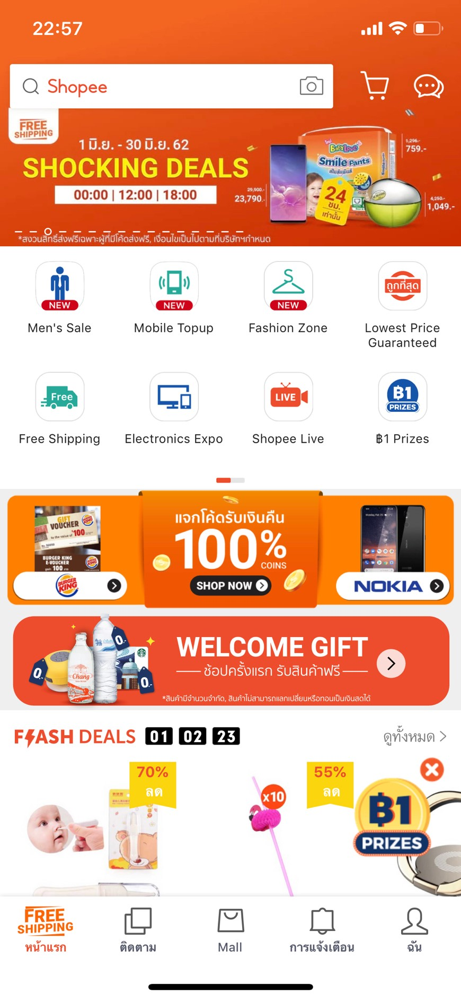

**Shopee**

* 

* Shopee เป็นตลาดซื้อขายแบบโซเชียลที่มุ่งเน้นการใช้งานผ่านโทรศัพท์มือถืออันดับแรก (Mobile First)
 เพื่อให้ทุกคนสามารถเลือกดูและซื้อขายได้อย่างสะดวก โดยเป็นแพลตฟอร์มที่ออกแบบขึ้นเพื่อชาวเอเชียตะวันออกเฉียงใต้
 ด้วยการผสานคุณลักษณะของตลาดซื้อขายแบบผู้บริโภคสู่ผู้บริโภค (C2C) เข้ากับระบบการชำระเงินและการสนับสนุนด้านโลจิสติกส์
 เพื่อให้การช้อปปิ้งออนไลน์กลายเป็นเรื่องที่สะดวก ปลอดภัย และไร้ความยุ่งยาก 

**ต้องการซื้อ-ขายของต้องทำอย่างไร?** หากเราต้องการใช้งานแอพพลิเคชั่น ต้องทำการยืนยันตัวตน ได้ 4 ช่องทางดังนี้

* **1.ลงทะเบียนด้วย เบอร์โทรศัพท์**

* **2.ลงทะเบียนด้วย Email**
* **3.ลงทะเบียนด้วย Line**
* **4.ลงทะเบียนด้วย Facebook**

**Referance :** https://www.sanook.com/money/524013/
