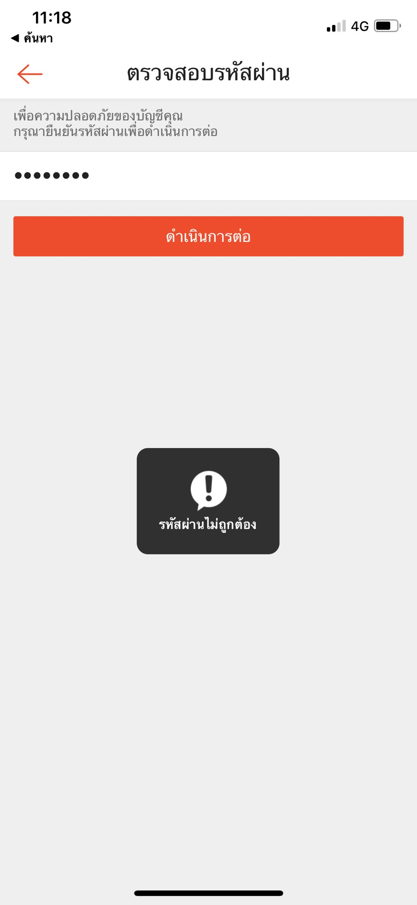

**invalid Case**
  

    
  

  
*Preconditions : เปลี่ยนรหัสผ่านผู้ใช้งาน Shopee

*Action : การยืนยันรหัสผ่านเดิมไม่ถูกต้อง

*input :  กรอกรหัสผ่าน

*expected Result : แจ้งข้อความ "รหัสผ่านไม่ถูกต้อง"

  

    
  

